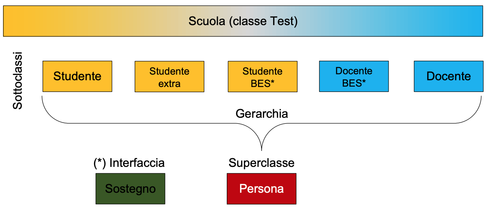

Esercizio Scuola

---

Traccia: 

Scrivere un programma di gestione di una scuola, con incapsulamento dei dati, che permetta di stampare elenchi di studenti e docenti di una scuola, utilizzando l'ereditarietà attraverso la superclasse Persona per raggruppare le caratteristiche comuni alle sottoclassi
Studente e Docente: nome, cognome, anno di nascita. Gli studenti avranno l'esclusiva della classe, sezione frequentata e matricola, i docenti della materia insegnata.
L'anno di nascita dovrà essere sottoposto a un filtro che accetti docenti nati tra il 1963 e il 1993, e studenti nati prima del 2017, con relativo messaggio di avviso sull'esito dell'inserimento; il metodo di controllo dovrà di conseguenza essere abstract in superclasse.
La matricola dev'essere univoca di 6 caratteri (anche se inizia per 0) composta dalle ultime due cifre dell'anno di nascita, da un numero progressivo di tre cifre e dalla sezione frequentata (per es.: 15088B per uno studente del 2015 iscritto in una sezione B, 88° come numero progressivo da 000 a 999).
La scuola accoglie studenti con bisogni educativi speciali (BES), per i quali è previsto un docente di sostegno. Per tali studenti andrà prevista una classe Java StudenteBES che consenta di assegnargli il docente di sostegno. Discorso analogo per i docenti di sostegno, per i quali andrà prevista una classe Java DocenteBES che consenta di definire da 1 a 3 studenti BES assegnati a esso. Entrambe le saranno gestite attraverso un'interfaccia Sostegno. Gli abbinamenti andranno fatti previo semplice inserimento dei nomi, senza collegare tra loro istanze di DocenteBES con istanze di StudenteBES. Predisporre un menù da terminale per inserire la figura scolastica desiderata tra le categorie previste, nonché la possibilità di stampare gli elenchi di tutti gli studenti e/oppure di tutti i docenti su richiesta.

Esercizio svolto con Stefano Giovannelli
